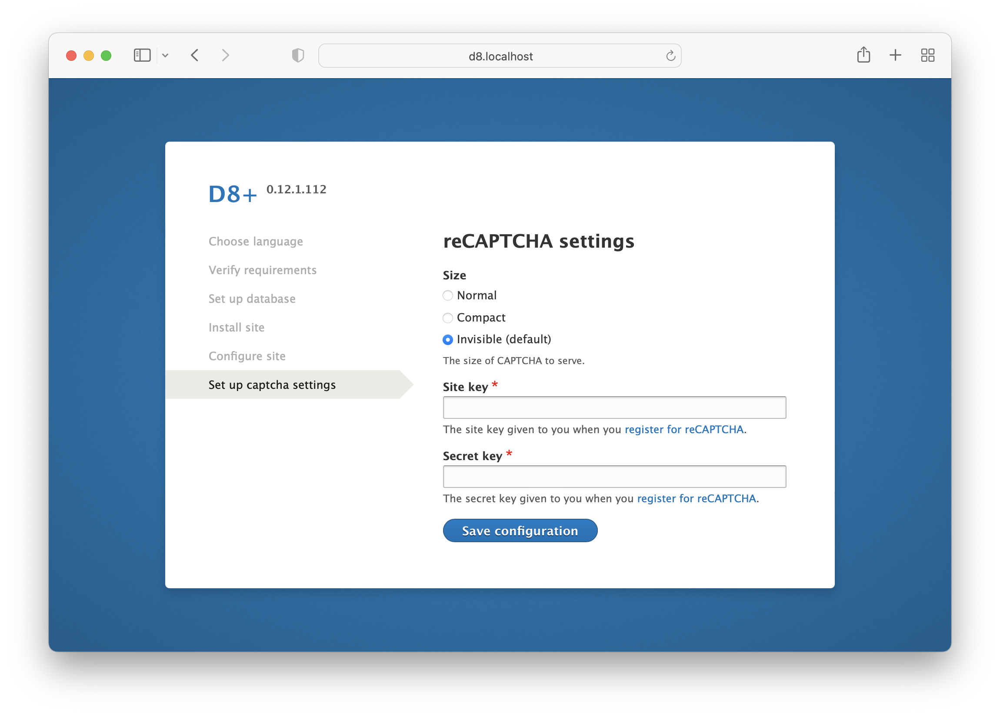
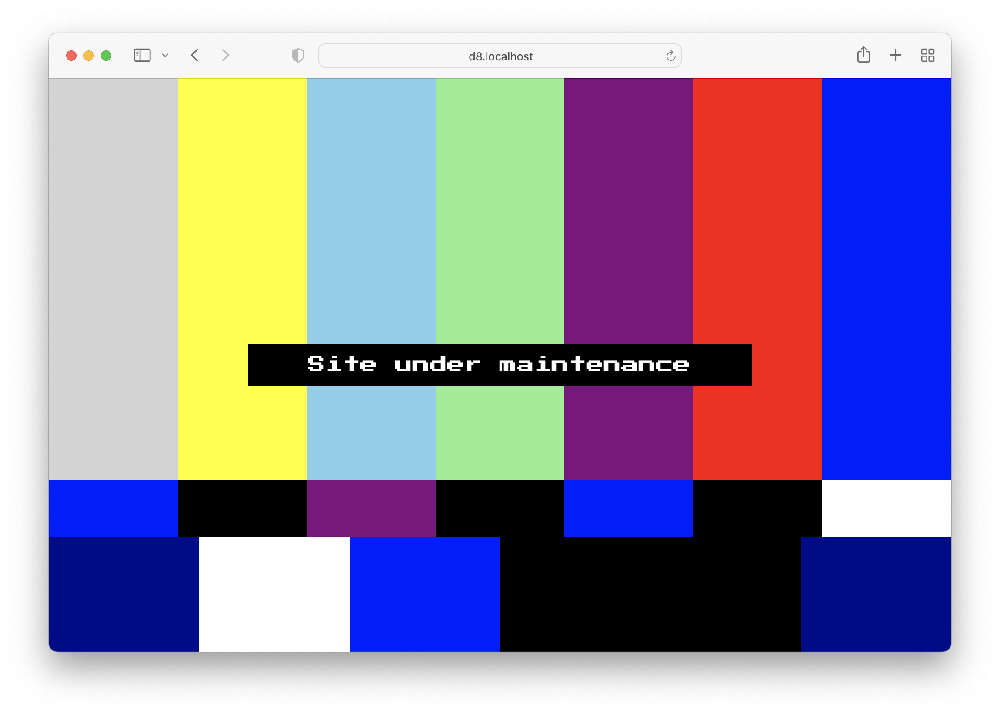

# D8+

Installation profile for Drupal 10.

## Table of contents

- Requirements
- Recommended module
- Features
- Mirror

## Requirements

This installation profile requires the following modules:

- [Admin Toolbar](https://www.drupal.org/project/admin_toolbar)
- [Automatic IP ban (Autoban)](https://www.drupal.org/project/autoban)
- [CAPTCHA](https://www.drupal.org/project/captcha)
- [Configuration Update Manager](https://www.drupal.org/project/config_update)
- [Drupal Symfony Mailer](https://www.drupal.org/project/symfony_mailer)
- [Error & Exception Mailer](https://www.drupal.org/project/exception_mailer)
- [Features](https://www.drupal.org/project/features)
- [Module Filter](https://www.drupal.org/project/module_filter)
- [reCAPTCHA](https://www.drupal.org/project/recaptcha)
- [reCAPTCHA Preloader](https://www.drupal.org/project/recaptcha_preloader)
- [StandWithUkraine 🇺🇦](https://www.drupal.org/project/standwithukraine)

This installation profile requires the following themes:

- [Bootstrap](https://www.drupal.org/project/bootstrap)
- [Seven](https://www.drupal.org/project/seven)

## Recommended module

[Config Export to PHP array](https://www.drupal.org/project/config2php): When
enabled, provides a page like the Single export page for getting configuration
in PHP array style.

## Features

### New installation step for setting captcha keys

### Maintenance mode

## Mirror

[GitLab](https://gitlab.com/chmez/d8)
