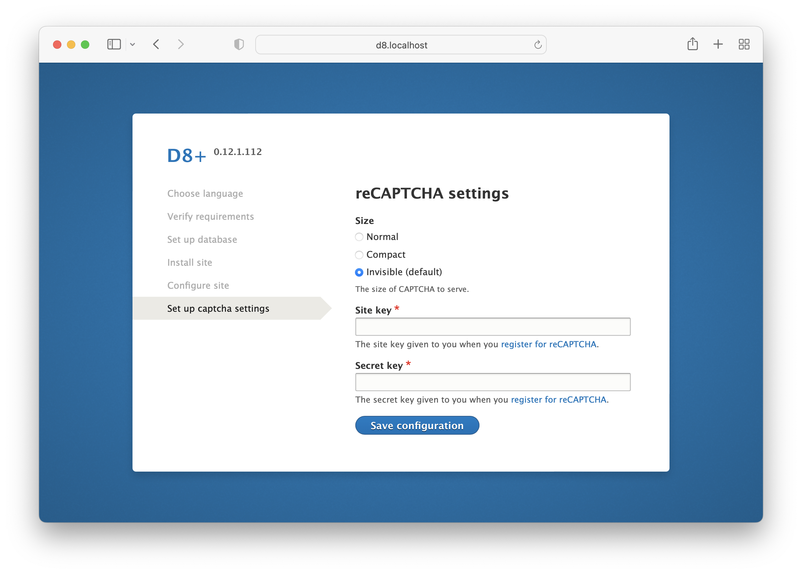

# D8+

The installation profile for CMS Drupal 11 based on the most common modules and
themes that form the basis for creating a stable site.

## Requirements

This installation profile requires the following extensions:

- [Admin Toolbar](https://www.drupal.org/project/admin_toolbar)
- [Automatic IP ban (Autoban)](https://www.drupal.org/project/autoban)
- [Bootstrap](https://www.drupal.org/project/bootstrap)
- [CAPTCHA](https://www.drupal.org/project/captcha)
- [Chaos Tool Suite (ctools)](https://www.drupal.org/project/ctools)
- [Config Export to PHP array](https://www.drupal.org/project/config2php)
- [Configuration Update Manager](https://www.drupal.org/project/config_update)
- [Drupal Symfony Mailer Plus (DSM+)](https://www.drupal.org/project/symfony_mailer)
- [Error & Exception Mailer](https://www.drupal.org/project/exception_mailer)
- [External Links](https://www.drupal.org/project/extlink)
- [Features](https://www.drupal.org/project/features)
- [Font Awesome Icons](https://www.drupal.org/project/fontawesome)
- [Idle](https://www.drupal.org/project/idle)
- [Module Filter](https://www.drupal.org/project/module_filter)
- [Pathauto](https://www.drupal.org/project/pathauto)
- [Persistent Login](https://www.drupal.org/project/persistent_login)
- [reCAPTCHA](https://www.drupal.org/project/recaptcha)
- [reCAPTCHA Preloader](https://www.drupal.org/project/recaptcha_preloader)
- [Service](https://www.drupal.org/project/service)
- [StandWithUkraine 🇺🇦](https://www.drupal.org/project/standwithukraine)
- [Token](https://www.drupal.org/project/token)
- [Ultimate Cron Summary](https://www.drupal.org/project/ultimate_cron_summary)

## Feature

New installation step for setting captcha keys:

## Mirrors

- [GitHub](https://github.com/ohorbatiuk/d8)
- [GitLab](https://gitlab.com/ohorbatiuk/d8)
